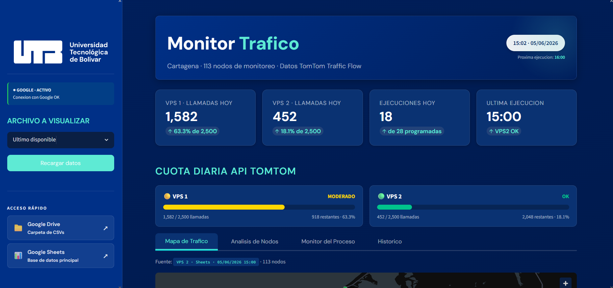

# 🚦 Smart Mobility Cartagena

**Observatorio Académico de Tráfico Urbano** — Universidad Tecnológica de Bolívar

Sistema distribuido que recolecta, almacena y publica datos de tráfico en tiempo real para la ciudad de Cartagena de Indias. Monitorea **113 nodos** sobre las principales vías consultando la **API TomTom Traffic Flow**, y expone los resultados en un tablero web interactivo.

🔗 **Sistema en vivo:** [tomtom-utb.duckdns.org](https://tomtom-utb.duckdns.org)



---

## 📋 Descripción

El sistema implementa un proceso **ETL** (Extract–Transform–Load) que se ejecuta automáticamente **28 veces al día**, repartido entre dos servidores. Cada ejecución consulta la velocidad de circulación en los 113 nodos, calcula indicadores de congestión y persiste los resultados en dos capas de almacenamiento independientes.

### Características

- 🛰️ **Extracción automática** desde TomTom Traffic Flow API (113 nodos)
- ⏱️ **Automatización** con cron en dos servidores VPS (Turnos 1–4)
- 💾 **Almacenamiento dual:** Google Sheets/Drive + PostgreSQL
- 📊 **Dashboard interactivo** con mapa, análisis, monitoreo e histórico
- 🛣️ **Mapa de calles trazadas** con la geometría real de cada segmento vial
- 🔥 **Snapshot a Firestore** que alimenta el motor de ETAs de la app TransCaribe
- 📈 **Indicadores de congestión** alineados con el TomTom Traffic Index
- 💰 **Costo de operación:** USD 0.00 (APIs dentro de su cuota gratuita)

---

## 🏗️ Arquitectura

```
                    ┌─→ Google Sheets / Drive (respaldo)
VPS 1 ──────────────┤
(Turnos 1-2)        └─→ PostgreSQL ←──────┐
                                          │
VPS 2 ──────────────┬─→ Google Sheets     │ (vía red)
(Turnos 3-4)        └─→ PostgreSQL ────────┘
                              │
                         Dashboard (Streamlit) → Usuario
```

| Servidor | Turnos | Consumo diario |
|----------|--------|----------------|
| **VPS 1** | Turno 1 + 2 (04:00–13:00) | 1.582 llamadas |
| **VPS 2** | Turno 3 + 4 (13:30–00:00) | 1.582 llamadas |

> Se usan dos cuentas TomTom independientes para no superar el límite gratuito de 2.500 llamadas/día por cuenta.

---

## 🧰 Tecnologías

| Tecnología | Rol |
|------------|-----|
| Python 3.10 | Proceso ETL y dashboard |
| TomTom Traffic Flow API v4 | Fuente de datos de tráfico |
| Oracle Cloud (2 VPS) | Servidores de ejecución |
| cron + Bash | Automatización |
| Google Sheets / Drive | Almacenamiento documental |
| PostgreSQL 14 | Almacenamiento relacional |
| Firebase Firestore | Snapshot en vivo para la app TransCaribe |
| Streamlit + Plotly | Dashboard web |
| SQLAlchemy + psycopg2 | Acceso a PostgreSQL |

---

## 📁 Estructura del repositorio

```
proyect_r/
├── src/
│   ├── config.py             # Configuración centralizada (variables de entorno)
│   ├── descargar_trafico.py  # Proceso ETL principal
│   ├── google_upload.py      # Subida/lectura de Google Sheets y Drive
│   ├── db.py                 # Acceso a PostgreSQL (lectura por rango de fechas)
│   ├── subir_firestore.py    # Snapshot de tráfico para la app TransCaribe
│   └── autorizar_google.py   # Generación del token OAuth (una vez)
├── dashboard/
│   └── monitor.py            # Dashboard Streamlit
├── deploy/
│   ├── run.sh                # Wrapper que ejecuta el ETL
│   ├── crontab_vps1.txt      # Horarios de VPS 1
│   └── crontab_vps2.txt      # Horarios de VPS 2
├── migrar_a_postgres.py      # Migración Sheets → PostgreSQL (verificada)
├── capturar_geometria.py     # Captura única de la traza real de cada vía
├── nodos.xlsx                # Catálogo de los 113 nodos
└── requirements.txt          # Dependencias
```

---

## ⚙️ Instalación

```bash
# Clonar el repositorio
git clone https://github.com/Manuuell/Monitor-TraficoCTG.git
cd Monitor-TraficoCTG

# Entorno virtual e instalación de dependencias
python3 -m venv venv
source venv/bin/activate        # Windows: venv\Scripts\activate
pip install -r requirements.txt
```

### Variables de entorno (`.env`)

```bash
TOMTOM_API_KEY=tu_clave_tomtom
VPS_ID=1
SHEET_ID=id_de_tu_google_sheet
DRIVE_FOLDER_ID=id_de_tu_carpeta_drive
SUBIR_A_GOOGLE=true

# PostgreSQL (opcional)
DB_HOST=localhost
DB_NAME=trafico
DB_USER=trafico_user
DB_PASSWORD=tu_clave
GUARDAR_EN_DB=true
FUENTE_DASHBOARD=db

# Firestore (opcional — app TransCaribe)
SUBIR_A_FIRESTORE=true
```

---

## ▶️ Uso

**Ejecutar una descarga manual:**
```bash
python3 src/descargar_trafico.py
```

**Levantar el dashboard:**
```bash
streamlit run dashboard/monitor.py
```

**Capturar la geometría de las calles** (una sola vez, habilita el modo "Calles" del mapa):
```bash
python3 capturar_geometria.py
```

**Automatizar con cron** (instalar la tabla de horarios):
```bash
crontab deploy/crontab_vps1.txt
```

---

## 💾 Capas de almacenamiento

Cada ejecución escribe en varias capas independientes. Si una falla, el ETL
continúa y las demás conservan el dato.

| Capa | Contenido | Rol |
|------|-----------|-----|
| **PostgreSQL** | Histórico completo | Fuente de lectura del dashboard (`FUENTE_DASHBOARD=db`) |
| **Google Sheets** | Histórico fila por fila | Respaldo documental y consulta manual |
| **Google Drive** | Un CSV por ejecución + volcado diario de la base | Copia off-site |
| **Firestore** | Solo el último snapshot (`traffic/latest`) | Velocidades en vivo para la app TransCaribe |

> ⚠️ Google limita cada hoja de cálculo a **10 millones de celdas**. El dashboard
> muestra en la barra lateral el porcentaje ocupado y la fecha estimada en que
> se alcanzará el límite, porque al llegar las escrituras a Sheets fallan en
> silencio.

---

## 📊 Indicadores

| Indicador | Fórmula | Significado |
|-----------|---------|-------------|
| **Ratio de velocidad** | `currentSpeed / freeFlowSpeed` | 1.0 = sin tráfico · 0.0 = detenido |
| **Índice de congestión** | `100 × (currentTT − freeFlowTT) / freeFlowTT` | % de tiempo adicional por tráfico |

**Clasificación:**

| Nivel | Ratio | Estado |
|-------|-------|--------|
| 🟢 Fluido | > 0.90 | Circula cerca de velocidad libre |
| 🟡 Moderado | 0.75 – 0.90 | Reducción leve |
| 🟠 Lento | 0.60 – 0.75 | Congestión apreciable |
| 🔴 Congestionado | < 0.60 | Velocidad muy reducida |

